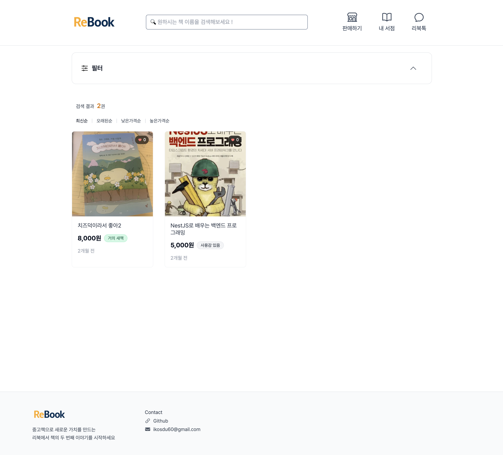
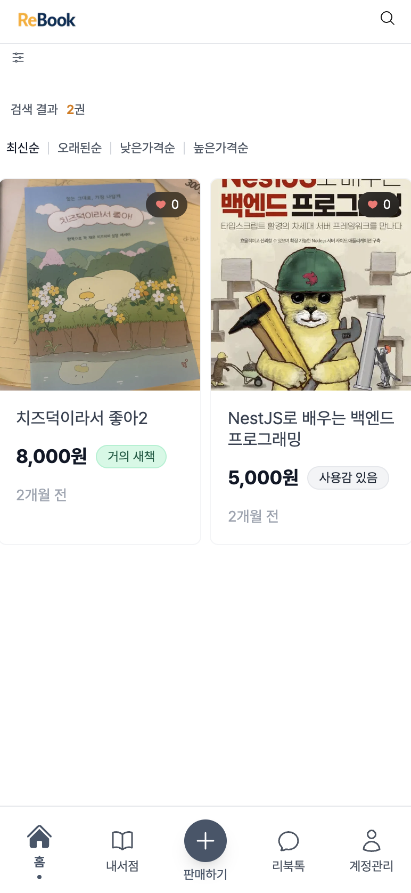
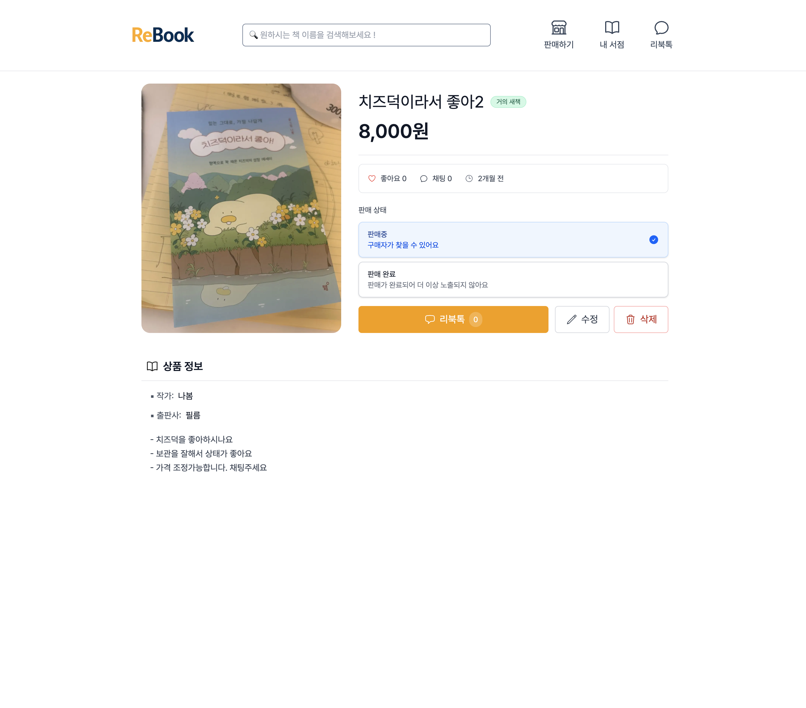
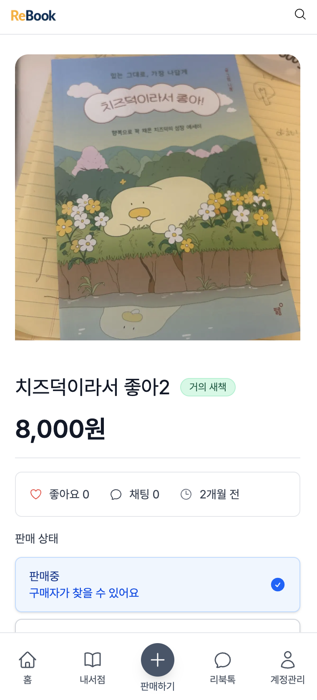
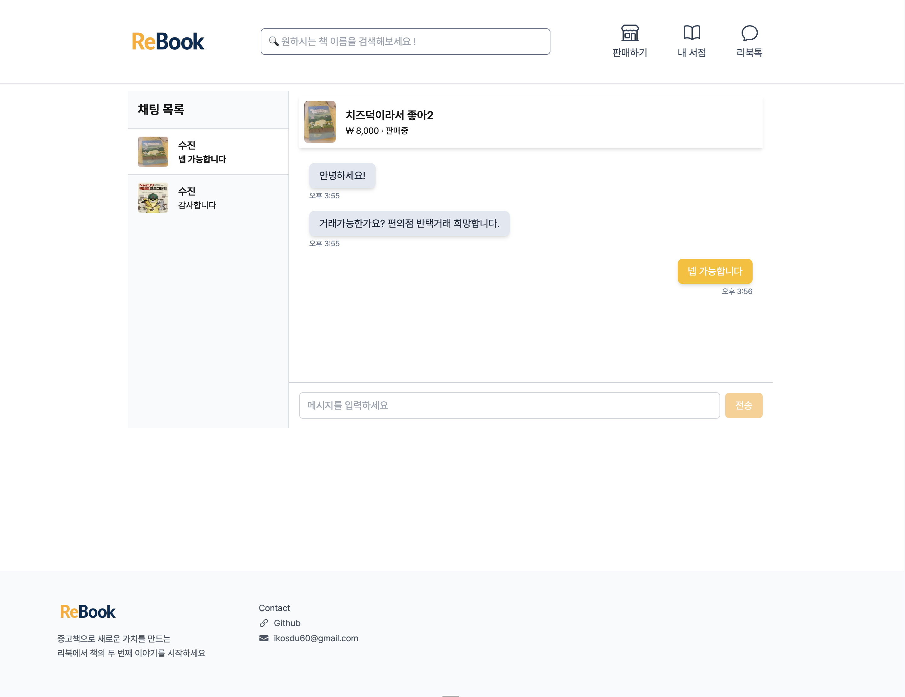
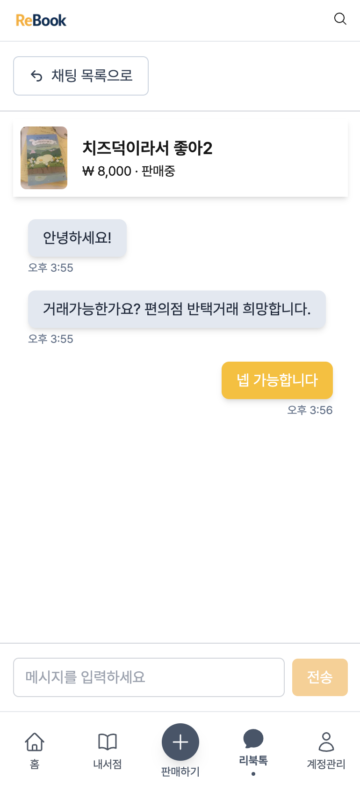

# 📚 Re-Book (리북)

> 중고 책 거래를 위한 풀스택 웹 애플리케이션

## 🎯 프로젝트 개요

Re-Book은 중고 책 거래를 간편하게 할 수 있는 플랫폼입니다. 판매자는 책을 등록하고 관리할 수 있으며, 구매자는 실시간 채팅을 통해 거래를 진행할 수 있습니다. 현대적인 웹 기술 스택을 활용하여 사용자 친화적인 인터페이스와 실시간 기능을 구현했습니다.

**[📌 라이브 데모 보기](https://rebook-v2.d2nh4o8zioz2s8.amplifyapp.com//)**

## 🛠 기술 스택

### Frontend
- **Framework**: Next.js 15 (App Router)
- **Language**: TypeScript, React 19
- **Styling**: TailwindCSS
- **State Management**: TanStack Query 5 + Zustand
- **Real-time**: Socket.IO Client
- **Forms & Animation**: React Hook Form + Framer Motion
- **HTTP Client**: Axios

### Backend & Infrastructure
- **Backend**: NestJS (Node.js)
- **Database**: PostgreSQL
- **Authentication**: JWT + Refresh Token
- **File Storage**: AWS S3 + CloudFront
- **Hosting**: AWS Amplify (Frontend), AWS EC2 (Backend)


## ✨ 주요 기능

### 📋 핵심 기능
- **책 거래 시스템**: 중고 책 등록, 수정, 삭제 관리
- **실시간 채팅**: Socket.IO 기반 1:1 채팅 및 읽음 상태 처리
- **검색 & 필터링**: 제목, 카테고리, 상태별 실시간 검색
- **찜하기 시스템**: 관심 있는 책 북마크 기능
- **이미지 관리**: AWS S3 연동 다중 이미지 업로드

### 🔐 인증 & 보안
- **회원가입/로그인**: 이메일 인증 기반 가입
- **JWT 인증**: Access Token + Refresh Token 구조
- **보안**: HttpOnly 쿠키 기반 토큰 관리

### 📱 사용자 경험
- **반응형 디자인**: 모바일/태블릿/데스크탑 완벽 대응
- **Progressive UI**: 로딩 상태, 에러 핸들링
- **직관적 인터페이스**: 사용자 중심의 UX/UI 설계

## 🎨 화면 구성

### 메인 페이지


**🖥️ 데스크탑** 



<br />

**📱모바일**



- 등록된 책 목록 조회
- 실시간 검색 및 필터링
- 카드 형태의 책 정보 표시

### 책 상세 페이지
**🖥️ 데스크탑**



<br />

**📱모바일**



- 상세 정보 및 이미지 캐러셀
- 판매자와의 채팅 시작
- 찜하기 기능

### 실시간 채팅
**🖥️ 데스크탑**



<br />

**📱모바일**



- 실시간 메시지 송수신
- 읽음 상태 표시
- 채팅방 목록 관리


## 🏗 프로젝트 구조

```
src/
├── app/                    # Next.js App Router
│   ├── (main)/            # 메인 레이아웃 그룹
│   │   ├── (home)/        # 홈 페이지
│   │   ├── book/          # 책 관련 페이지
│   │   ├── chat/          # 채팅 페이지
│   │   └── my-bookstore/  # 내 서재
│   └── (none-layout)/     # 레이아웃 없는 페이지 그룹
│       ├── login/
│       └── signup/
├── components/            # 공통 컴포넌트
│   ├── layout/           # 레이아웃 컴포넌트
│   └── ui/              # UI 컴포넌트
├── hooks/               # Custom Hooks
├── lib/                 # 유틸리티 & 설정
│   ├── api/            # API 클라이언트
│   ├── contexts/       # React Context
│   └── utils/          # 헬퍼 함수
└── types/              # TypeScript 타입 정의
```

## 📊 기술적 주요 구현 사항

- **반응형 디자인**: useMediaQuery 훅 활용, 데스크톱/모바일 컴포넌트 분리 설계
- **인증 시스템 고도화**: JWT + HttpOnly Refresh Token, Axios 인터셉터 자동 갱신, 401 에러 핸들링
- **실시간 통신 안정성**: Socket.IO 연결 상태 모니터링, 토큰 만료 감지, 3초/5초 지연 재연결 로직
- **효율적인 상태 관리**: TanStack Query(서버 상태) + Zustand(클라이언트 상태) 역할 분리
- **멀티미디어 처리**: AWS S3 멀티파트 업로드, CloudFront CDN 연동, 이미지 최적화

### 📝 기술 블로그
- **[RefreshToken을 왜 쿠키에 저장해야할까?](https://sj0826.github.io/network/network-RefreshToken%EC%9D%84-%EC%99%9C-%EC%BF%A0%ED%82%A4%EC%97%90-%EC%A0%80%EC%9E%A5%ED%95%B4%EC%95%BC%ED%95%A0%EA%B9%8C/)**
- **[Tanstack Query의 HydrationBoundary를 이용해 초기 렌더링 속도 감축하기](https://sj0826.github.io/nextjs/nextjs-TanStack-Query%EB%A1%9C-SSR-%EB%8D%B0%EC%9D%B4%ED%84%B0-%EC%B2%98%EB%A6%AC%ED%95%98%EA%B8%B0-(with-HydrationBoundary)/#-%EC%9E%A5%EC%A0%90-%EC%9A%94%EC%95%BD)**


---

*이 프로젝트는 개인 포트폴리오 목적으로 제작되었습니다.*
